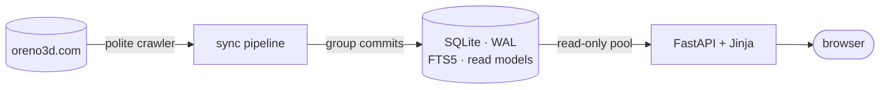

<div align="center">


# Search Iwara

**Fast, faceted search for a local mirror of [Oreno3D](https://oreno3d.com/) metadata.**

Find the MMD / 3D videos you want by title, author, character, origin and tag — with boolean
filters, ranges and rankings the original site doesn't offer. Self-hosted, a single SQLite file.

[](https://github.com/beautifulrem/iwara-search/actions/workflows/ci.yml)
[](https://github.com/beautifulrem/iwara-search/releases)
[](pyproject.toml)
[](https://github.com/astral-sh/uv)
[](https://github.com/astral-sh/ruff)
[](pyproject.toml)
[](LICENSE)

[**Live demo (NSFW)**](https://zundamon.dpdns.org/) ·
[Quick start](#quick-start) ·
[Deploy](docs/linux-deploy.md) ·
[Architecture](docs/architecture.md) ·
[简体中文](README.zh-CN.md) ·
[LINUX DO](https://linux.do/)

</div>

> [!WARNING]
> The indexed metadata and the live demo are **adult content**. Don't open them at work or in public.
> This project downloads and hosts **no video files** — it only indexes publicly listed metadata.

<picture>
  <source media="(prefers-color-scheme: dark)" srcset="docs/assets/screenshots/home-dark.jpg">
  
</picture>
<sub>Screenshots use a made-up, work-safe demo catalogue with generated artwork — see <a href="scripts/make_screenshots.py"><code>scripts/make_screenshots.py</code></a>.</sub>

## Highlights

- 🔎 **One box searches everything** — titles *and* author, character, origin and tag names, with
  substring matching for Latin and CJK text; every query is answered from an index (FTS5 trigram + CJK n-grams).
- 🧩 **Real filtering** — include/exclude authors, origins and characters; tags with *all / any / not*;
  date, view and like ranges; every active filter is a removable chip.
- 📈 **Eight sort orders & rankings** — trending, popular, most liked, newest (plus views and ascending
  variants), weighted related videos, and leaderboards for characters, authors, tags and origins.
- ✨ **A modern, accessible UI** — light/dark/system themes, keyboard-driven autocomplete, mobile
  bottom sheets, works without JavaScript, 中文 / 日本語 / English. Checked with axe in three browsers.
- 🤝 **A polite crawler** — robots.txt (RFC 9309), adaptive rate limiting, jittered retries that honour
  `Retry-After`, proxy support, resumable full crawls and loud failure when the site's markup changes.
- 🛠️ **Built to run unattended** — versioned migrations, online backups, JSON logs, health checks,
  Prometheus metrics with alert rules, hardened systemd units and a Docker image.

<table>
  <tr>
    <td width="50%"></td>
    <td width="50%"></td>
  </tr>
  <tr>
    <td align="center"><sub>Grouped boolean filters with autocomplete</sub></td>
    <td align="center"><sub>Detail page with metadata and related videos</sub></td>
  </tr>
</table>

<p align="center">
  
  &nbsp;&nbsp;
  
</p>

## Quick start

Requires Python 3.13 and [uv](https://docs.astral.sh/uv/).

```bash
git clone https://github.com/beautifulrem/iwara-search.git && cd iwara-search
uv sync
uv run search-iwara sync latest --max-pages 3   # fetch the newest movies (~1 minute)
uv run search-iwara serve                       # → http://127.0.0.1:8000
```

Or with Docker (web UI, periodic sync and daily backups):

```bash
docker compose up -d                            # → http://127.0.0.1:8000
```

For a complete mirror run `uv run search-iwara sync full`. It is resumable: interrupt it any time
and run it again to continue where it stopped.

> [!NOTE]
> **Crawl responsibly.** The defaults — 4 concurrent requests, at most 2 requests/s, an honest
> User-Agent, robots.txt respected, automatic slow-down on HTTP 429/503 — are deliberately gentle,
> so a full crawl takes hours. Please keep it that way and follow the site's terms of use.

## Usage

<details>
<summary><b>Command line</b></summary>

| Command | Purpose |
|---|---|
| `search-iwara sync latest [--stable-pages N] [--max-pages N]` | Incremental sync: stops after N pages without new movies |
| `search-iwara sync full [--start-page N] [--max-pages N]` | Resumable crawl of the whole catalogue |
| `search-iwara db migrate` | Create / upgrade the schema (idempotent) |
| `search-iwara db backup [--dest DIR] [--keep N]` | Consistent online backup with rotation |
| `search-iwara db refresh` | Recompute rankings and trending scores |
| `search-iwara serve [--host] [--port] [--reload]` | Start the web UI |

Both sync commands accept `--request-concurrency` and `--request-rate`. Exit codes: `0` ok,
`1` failures above tolerance or robots.txt unreachable, `2` the site's markup changed,
`75` another sync is running, `78` invalid configuration, `143` stopped by SIGTERM (progress kept).

</details>

<details>
<summary><b>Search parameters & examples</b></summary>

Every filter is a query parameter on `/`, so any search is a shareable URL.

| Group | Parameters |
|---|---|
| Text | `q` (title and names, ≤ 200 chars), `title_mode=all\|any` |
| Authors · Origins · Characters | `author_any` `author_not` · `origin_any` `origin_not` · `character_any` `character_not` |
| Tags | `tag_all`, `tag_any`, `tag_not` |
| Ranges | `published_from`, `published_to` (`YYYY-MM-DD`), `min_views`, `max_views`, `min_favorites`, `max_favorites` |
| Sort | `sort=hot\|popularity\|favorites\|latest\|views`, or `…_desc` / `…_asc` variants |
| Other | `page`, `lang=zh-Hans\|ja\|en` |

Id lists are comma-separated source ids (≤ 20 per parameter).

```
/?q=Yelan                                   title or names contain "Yelan"
/?author_any=4972&sort=hot                  one author, trending first
/?origin_any=276&character_any=1470         an origin and a character
/?tag_any=2,3&tag_not=84                    either tag, but never tag 84
/?min_views=1000&min_favorites=100&sort=popularity
```

</details>

<details>
<summary><b>Scoring</b></summary>

Rankings are computed from **your local data**, not the site's global rankings.

| Order | Formula |
|---|---|
| Most liked | `favorite_count DESC` |
| Newest | `published_at DESC` |
| Popular | `view_count + favorite_count × 50` |
| Trending | `popularity / (hours since publish + 6)`, refreshed after each sync |

**Related videos** (up to 12): same author +10, each shared character or origin +5, each shared tag +1;
ties broken by popularity. Entities attached to more than 5 % of the catalogue are ignored.

</details>

## How it works



A batch crawler and a web app share one SQLite database — no queue, search engine or cache server
to operate. Listing pages and detail pages flow through a bounded pipeline with group commits;
rankings are precomputed read models; every query shape is served by an index. The full story —
schema, sync algorithm, politeness and security model — is in [docs/architecture.md](docs/architecture.md).

## Deployment

| Target | How |
|---|---|
| Linux server | `sudo ./deploy/linux/install.sh --sync-hours 6` — systemd units (hardened), nginx, backups, alerts. Or the interactive `sudo ./deploy/linux/manage.py`. → [docs/linux-deploy.md](docs/linux-deploy.md) |
| Docker | `docker compose up -d` → [docs/linux-deploy.md#docker](docs/linux-deploy.md#docker) |
| Configuration | every setting is a `SEARCH_IWARA_*` variable → [docs/configuration.md](docs/configuration.md) |
| Monitoring | `/healthz`, `/readyz`, `/metrics` + [Prometheus alert rules](deploy/prometheus/alerts.yml) |
| Troubleshooting | [docs/troubleshooting.md](docs/troubleshooting.md) |

## Development

```bash
uv sync && uv run pre-commit install
make check   # ruff · mypy --strict · tsc --checkJs · tests with a 95 % coverage gate
make perf    # latency budgets on a 200 000-movie synthetic database
make e2e     # Playwright end-to-end + axe accessibility tests
make serve   # dev server with auto-reload on :8765
```

<details>
<summary><b>Project layout</b></summary>

```
search_iwara/
  cli.py               Typer CLI (sync, db, serve) with stable exit codes
  config.py            Validated settings (SEARCH_IWARA_* environment variables)
  crawler.py           Polite HTTP client: robots.txt, adaptive rate limit, retries
  parsers.py           HTML → models, URL allow-list, parser-drift detection
  services.py          Sync pipeline: listing scan → detail workers → group commits
  storage/             SQLite: migrations, write model, FTS maintenance, read models
  web/                 FastAPI app, pages, API, ops endpoints, security & metrics middleware
  templates/, static/  Jinja templates, CSS, ES modules, icons
  i18n.py, locales/    Translations (zh-Hans, ja, en) and language negotiation
tests/                 Unit, property, integration, snapshot, performance and browser tests
deploy/                systemd, nginx, deployment manager, Docker helpers, Prometheus rules
scripts/               Regenerate the logo/icons and the README screenshots
docs/                  Architecture, configuration, deployment, accessibility, troubleshooting
```

</details>

## Contributing

Issues and pull requests are welcome — please read [CONTRIBUTING.md](CONTRIBUTING.md) first.
Security problems: see [SECURITY.md](SECURITY.md). Accessibility scope and known limits:
[docs/accessibility.md](docs/accessibility.md). Release notes: [CHANGELOG.md](CHANGELOG.md).

## Acknowledgements

- [Oreno3D](https://oreno3d.com/) and [Iwara](https://www.iwara.tv/) and their creators — all metadata and thumbnails belong to their respective owners.
- Built with [FastAPI](https://fastapi.tiangolo.com/), [SQLite FTS5](https://www.sqlite.org/fts5.html), [HTTPX](https://www.python-httpx.org/), [selectolax](https://github.com/rushter/selectolax), [Typer](https://typer.tiangolo.com/) and [uv](https://github.com/astral-sh/uv).
- The faceted-lens logo is an original mark that nods to the angular, low-poly symbols of 3D/MMD culture.
  This project is not affiliated with or endorsed by Oreno3D or Iwara.

## License

[MIT](LICENSE)
