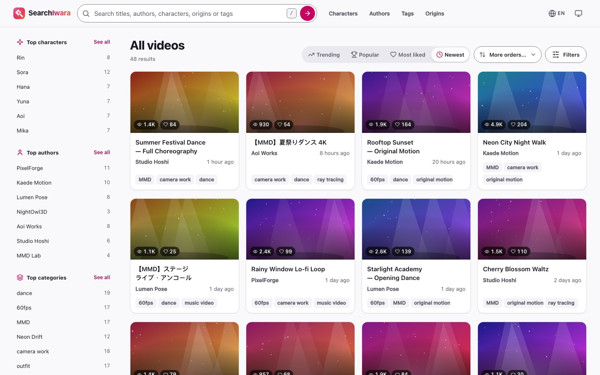
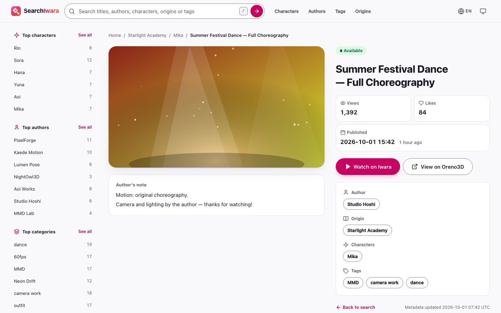
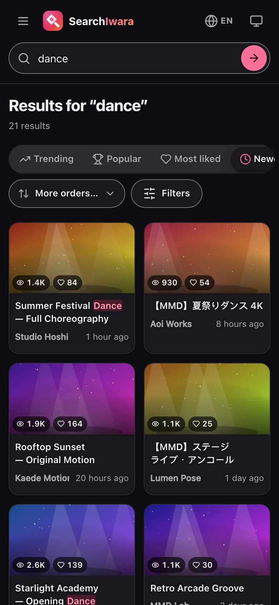

<div align="center">


# Search Iwara

**为 [Oreno3D](https://oreno3d.com/) 元数据本地镜像打造的快速、多维度搜索。**

按标题、作者、角色、原作、标签找到想看的 MMD / 3D 视频——支持布尔筛选、区间筛选和排行榜，
这些都是原站没有的能力。可自托管，数据只是一个 SQLite 文件。

[](https://github.com/beautifulrem/iwara-search/actions/workflows/ci.yml)
[](https://github.com/beautifulrem/iwara-search/releases)
[](pyproject.toml)
[](https://github.com/astral-sh/uv)
[](https://github.com/astral-sh/ruff)
[](pyproject.toml)
[](LICENSE)

[**在线示例（NSFW）**](https://zundamon.dpdns.org/) ·
[快速开始](#快速开始) ·
[部署](docs/linux-deploy.md) ·
[架构](docs/architecture.md) ·
[English](README.md) ·
[LINUX DO](https://linux.do/)

</div>

> [!WARNING]
> 索引的元数据和在线示例属于**成人内容**，请勿在办公或公共场合打开。
> 本项目**不下载、不托管任何视频文件**，只对公开列出的元数据建立索引。

<picture>
  <source media="(prefers-color-scheme: dark)" srcset="docs/assets/screenshots/home-dark.jpg">
  
</picture>
<sub>截图使用虚构的、适合公开展示的演示数据和生成的插图，见 <a href="scripts/make_screenshots.py"><code>scripts/make_screenshots.py</code></a>。</sub>

## 亮点

- 🔎 **一个搜索框搜全部**：同时匹配标题与作者、角色、原作、标签名；拉丁文和中日文都支持子串匹配，所有查询都走索引（FTS5 trigram + CJK n-gram）。
- 🧩 **真正的筛选**：作者 / 原作 / 角色的包含与排除，标签的全含 / 任一 / 排除，发布日期、播放数、点赞数区间；每个生效条件都是可单独移除的 chip。
- 📈 **八种排序与排行榜**：飙升、热门、高赞、最新（以及按播放数和各升序），加权的相关视频，角色 / 作者 / 标签 / 原作排行榜。
- ✨ **现代、无障碍的界面**：浅色 / 深色 / 跟随系统主题，键盘可操作的自动补全，移动端底部面板，禁用 JavaScript 也能用，中文 / 日本語 / English；在三种浏览器上用 axe 自动检查。
- 🤝 **礼貌的爬虫**：遵守 robots.txt（RFC 9309），自适应限速，带抖动并遵守 `Retry-After` 的重试，支持代理，全量抓取可续抓，站点改版时明确报错停止。
- 🛠️ **为无人值守而生**：版本化迁移、在线备份、JSON 日志、健康检查、Prometheus 指标与告警规则、加固的 systemd 单元、Docker 镜像。

<table>
  <tr>
    <td width="50%"></td>
    <td width="50%"></td>
  </tr>
  <tr>
    <td align="center"><sub>带自动补全的分组布尔筛选</sub></td>
    <td align="center"><sub>详情页：元数据与相关视频</sub></td>
  </tr>
</table>

<p align="center">
  
  &nbsp;&nbsp;
  
</p>

## 快速开始

需要 Python 3.13 和 [uv](https://docs.astral.sh/uv/)。

```bash
git clone https://github.com/beautifulrem/iwara-search.git && cd iwara-search
uv sync
uv run search-iwara sync latest --max-pages 3   # 抓取最新影片（约 1 分钟）
uv run search-iwara serve                       # → http://127.0.0.1:8000
```

或者用 Docker（Web 界面、定时同步、每日备份）：

```bash
docker compose up -d                            # → http://127.0.0.1:8000
```

需要完整镜像时运行 `uv run search-iwara sync full`。它可以续抓：随时中断，再次运行会从停下的地方继续。

> [!NOTE]
> **请负责任地抓取。** 默认参数有意保守：4 个并发、每秒最多 2 个请求、如实的 User-Agent、遵守 robots.txt、遇到 HTTP 429/503 自动降速，因此全量抓取需要数小时。请保持这样，并遵守站点的使用条款。

## 使用

<details>
<summary><b>命令行</b></summary>

| 命令 | 用途 |
|---|---|
| `search-iwara sync latest [--stable-pages N] [--max-pages N]` | 增量同步：连续 N 页没有新影片即停止 |
| `search-iwara sync full [--start-page N] [--max-pages N]` | 可续抓的全量同步 |
| `search-iwara db migrate` | 创建或升级数据库结构（幂等） |
| `search-iwara db backup [--dest DIR] [--keep N]` | 一致性在线备份并轮转 |
| `search-iwara db refresh` | 重算排行与飙升分 |
| `search-iwara serve [--host] [--port] [--reload]` | 启动 Web 界面 |

两个 sync 命令都支持 `--request-concurrency` 与 `--request-rate`。退出码：`0` 成功；`1` 失败超过容忍度或 robots.txt 不可达；`2` 站点结构变化；`75` 已有同步在运行；`78` 配置无效；`143` 被 SIGTERM 终止（已提交的进度会保留）。

</details>

<details>
<summary><b>搜索参数与示例</b></summary>

所有筛选都是 `/` 的查询参数，任何搜索都可以直接分享 URL。

| 类别 | 参数 |
|---|---|
| 文本 | `q`（匹配标题与各类名称，≤ 200 字符）、`title_mode=all\|any` |
| 作者 · 原作 · 角色 | `author_any` `author_not` · `origin_any` `origin_not` · `character_any` `character_not` |
| 标签 | `tag_all`、`tag_any`、`tag_not` |
| 区间 | `published_from`、`published_to`（`YYYY-MM-DD`）、`min_views`、`max_views`、`min_favorites`、`max_favorites` |
| 排序 | `sort=hot\|popularity\|favorites\|latest\|views`，或 `…_desc` / `…_asc` |
| 其他 | `page`、`lang=zh-Hans\|ja\|en` |

ID 列表为逗号分隔的源站 ID，每个参数最多 20 个。

```
/?q=Yelan                                   标题或名称包含 "Yelan"
/?author_any=4972&sort=hot                  指定作者，按飙升排序
/?origin_any=276&character_any=1470         指定原作与角色
/?tag_any=2,3&tag_not=84                    任一标签，但排除标签 84
/?min_views=1000&min_favorites=100&sort=popularity
```

</details>

<details>
<summary><b>评分与排行</b></summary>

所有排行都基于**本地已抓取的数据**计算，并不等同于原站的全站排行。

| 排序 | 公式 |
|---|---|
| 高赞 | `favorite_count DESC` |
| 最新 | `published_at DESC` |
| 热门 | `view_count + favorite_count × 50` |
| 飙升 | `热门分 / (发布后小时数 + 6)`，每次同步后刷新 |

**相关视频**（最多 12 个）：同作者 +10，每个共同角色或原作 +5，每个共同标签 +1；同分按热门分排序。关联超过全库 5% 影片的实体会被忽略。

</details>

## 工作原理


批量爬虫和 Web 应用共用一个 SQLite 数据库，不需要额外运维队列、搜索引擎或缓存服务。列表页与详情页经过有界流水线并批量提交；排行是预先计算的读模型；每种查询都有索引支撑。数据库结构、同步算法、礼貌性与安全模型的完整说明见 [docs/architecture.md](docs/architecture.md)。

## 部署

| 目标 | 方式 |
|---|---|
| Linux 服务器 | `sudo ./deploy/linux/install.sh --sync-hours 6`：加固的 systemd 单元、nginx、备份、告警；或交互式的 `sudo ./deploy/linux/manage.py`。→ [docs/linux-deploy.md](docs/linux-deploy.md) |
| Docker | `docker compose up -d` → [docs/linux-deploy.md#docker](docs/linux-deploy.md#docker) |
| 配置 | 所有配置都是 `SEARCH_IWARA_*` 环境变量 → [docs/configuration.md](docs/configuration.md) |
| 监控 | `/healthz`、`/readyz`、`/metrics`，以及 [Prometheus 告警规则](deploy/prometheus/alerts.yml) |
| 故障排查 | [docs/troubleshooting.md](docs/troubleshooting.md) |

## 开发

```bash
uv sync && uv run pre-commit install
make check   # ruff · mypy --strict · tsc --checkJs · 测试（覆盖率门槛 95%）
make perf    # 20 万影片合成库上的延迟预算
make e2e     # Playwright 端到端 + axe 无障碍测试
make serve   # 带自动重载的开发服务器（:8765）
```

<details>
<summary><b>项目结构</b></summary>

```
search_iwara/
  cli.py               Typer 命令行（sync / db / serve），退出码稳定
  config.py            经过校验的配置（SEARCH_IWARA_* 环境变量）
  crawler.py           礼貌的 HTTP 客户端：robots.txt、自适应限速、重试
  parsers.py           HTML 转为数据模型，URL 白名单，站点改版检测
  services.py          同步流水线：列表扫描 → 详情 worker → 批量提交
  storage/             SQLite：迁移、写模型、全文索引维护、读模型
  web/                 FastAPI 应用、页面、API、运维端点、安全与指标中间件
  templates/, static/  Jinja 模板、CSS、ES 模块、图标
  i18n.py, locales/    翻译文案（zh-Hans、ja、en）与语言协商
tests/                 单元、属性、集成、页面快照、性能与浏览器测试
deploy/                systemd、nginx、部署管理器、Docker 辅助脚本、Prometheus 规则
scripts/               重新生成图标与 README 截图
docs/                  架构、配置、部署、可访问性、故障排查
```

</details>

## 参与贡献

欢迎提交 Issue 和 Pull Request，开始前请先阅读 [CONTRIBUTING.md](CONTRIBUTING.md)。安全问题见 [SECURITY.md](SECURITY.md)；可访问性范围与已知限制见 [docs/accessibility.md](docs/accessibility.md)；更新记录见 [CHANGELOG.md](CHANGELOG.md)。

## 致谢

- [Oreno3D](https://oreno3d.com/)、[Iwara](https://www.iwara.tv/) 及其创作者：所有元数据与缩略图归各自所有者。
- 基于 [FastAPI](https://fastapi.tiangolo.com/)、[SQLite FTS5](https://www.sqlite.org/fts5.html)、[HTTPX](https://www.python-httpx.org/)、[selectolax](https://github.com/rushter/selectolax)、[Typer](https://typer.tiangolo.com/) 和 [uv](https://github.com/astral-sh/uv) 构建。
- 菱形镜片图标是原创设计，致敬 3D / MMD 文化中常见的棱角分明的低多边形符号。本项目与 Oreno3D、Iwara 无隶属或背书关系。

## 许可证

[MIT](LICENSE)
