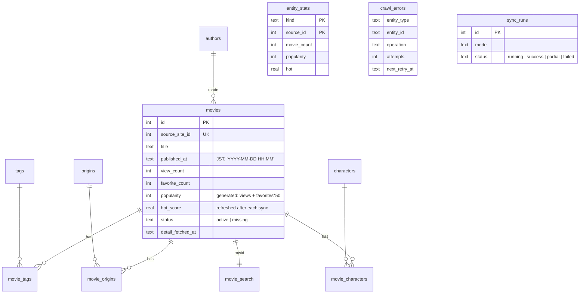

# Architecture

Search Iwara is a single-process web app plus a batch crawler that share one SQLite
database. There is no queue, cache server or search engine to operate: SQLite (WAL mode,
FTS5) is the whole data tier.

```mermaid
flowchart LR
    subgraph crawl ["search-iwara sync (systemd timer / cron / container loop)"]
        C[crawler.py<br/>rate limiter · retries · robots.txt] --> P[parsers.py<br/>HTML → models · URL allow-list]
        P --> S[services.py<br/>listing scan → bounded detail queue]
        S --> W[storage/crawl_store.py<br/>group commits · error ledger]
    end
    W -->|WAL| DB[(SQLite<br/>movies · relations · movie_search FTS5<br/>entity_stats · sync_runs)]
    DB -->|read-only, one connection per thread| R[storage/search_store.py<br/>storage/ranking_store.py]
    subgraph web ["search-iwara serve (uvicorn)"]
        R --> WEB[web/pages.py · web/api.py · web/ops.py]
        WEB --> T[Jinja templates + static assets]
    end
    O3D[(oreno3d.com)] --> C
```

## Modules

| Module | Responsibility |
|---|---|
| `config.py` | `Settings` (pydantic-settings): every knob, validated once, `SEARCH_IWARA_*` env vars |
| `models.py` | Dataclasses shared by all layers: crawl models (`MovieDetail`…), read models (`MovieCard`, `SearchPage`, `RankingRow`…), `SearchFilters` |
| `crawler.py` | `Oreno3dClient`: HTTP/2 client with robots.txt, AIMD token bucket, concurrency cap, error classification, full-jitter backoff, `Retry-After` |
| `parsers.py` | selectolax parsers; all URLs pass `utils.safe_url` (https + host allow-list); structural changes raise `ParserDriftError` |
| `services.py` | `SyncService`: `sync_latest` / `sync_full`, detail worker pool, run bookkeeping, `sync_lock` |
| `storage/migrations.py` | Ordered migrations keyed on `PRAGMA user_version` |
| `storage/crawl_store.py` | Write model: upserts, relation replacement, FTS maintenance, error ledger, derived-data refresh, run history |
| `storage/search_store.py` | Search (FTS5 trigram + LIKE for 1–2 char tokens), detail, related movies, autocomplete |
| `storage/ranking_store.py` | Rankings from the `entity_stats` read model; dataset status |
| `web/app.py` | App factory: lifespan (migrate once, open read-only pool), middleware, error pages, static caching |
| `web/pages.py`, `web/api.py`, `web/ops.py` | HTML pages; autocomplete JSON; `/healthz`, `/readyz`, `/metrics`, `robots.txt` |
| `web/query.py` | `SearchParams` query model: strict structural limits, lenient semantics |
| `web/security.py`, `web/metrics.py` | Pure-ASGI middleware for security headers and Prometheus metrics |
| `i18n.py` + `locales/*.toml` | Catalogs (zh-Hans, ja, en), Accept-Language negotiation |
| `cli.py` | Typer CLI: `sync`, `db migrate/backup/refresh`, `serve`; stable exit codes |

Dependencies point one way: `web` → `storage` → `models`; `services` → `crawler`/`parsers`/`storage`.
Nothing in `storage` knows about HTTP, and nothing in `web` writes to the database.

## Data model

* **`movie_search`** is a standalone FTS5 table (`tokenize='trigram'`) holding the title and
  a `keywords` column (author, character, origin and tag names). Trigram matching gives
  substring search for Latin *and* CJK text for tokens of three or more characters.
* **`movie_search_short`** (FTS5, `unicode61`, `prefix='1 2'`) stores every CJK unigram and
  bigram of the same document as separate tokens plus the document's non-CJK words. One- and
  two-character Chinese/Japanese queries — the most common kind — are exact token lookups; one-
  and two-letter Latin queries ("mm", "3d") are indexed *word-prefix* matches ("mm" → "MMD",
  deliberately not the substring inside "summer"). No query shape scans the table. Both tables
  are maintained by `storage/search_index.py` whenever a title or relation changes. On SQLite
  < 3.34 the trigram table falls back to `unicode61` and 3+ character tokens use `LIKE`.
* **`entity_stats`** is a materialised read model (per author/tag/origin/character: counts,
  popularity, hot score). Rankings and the sidebar read it instead of aggregating the movie
  table per request. It is rebuilt at the end of every sync (`CrawlStore.refresh_derived`,
  also `search-iwara db refresh`).
* **Indexes** are composite and match the queries: `(status, published_at DESC, …)`,
  `(status, favorite_count DESC, …)`, `(status, popularity DESC, …)`, `(status, hot_score DESC, …)`
  and reverse indexes on every join table for "movies with tag X" filters.

### `crawl_state` keys

| Key | Meaning |
|---|---|
| `sync_full_target_last_page` | Last listing page reported by the site when the current full run started |
| `sync_full_last_completed_page` | Highest page processed *contiguously* by full sync (frozen after a failed page) |
| `sync_full_round_started_at` | When the current full round started at page 1 (used to verify resume overlap) |
| `sync_latest_last_checked_page` | Last page scanned by the most recent `sync latest` |

## Sync algorithm

**`sync latest`** scans listing pages from page 1. A page is *stable* when it contains no
movie id we have not seen before (view/favourite counters change constantly, so they do not
count). The scan stops after `--stable-pages` consecutive stable pages, at the last page, at
`--max-pages`, or after three consecutive listing failures. Movies that are new or lack
details are pushed onto the detail queue as soon as their page is persisted. At the end the
queue also receives failed details that are due for a retry and up to
`SEARCH_IWARA_DETAIL_REFRESH_LIMIT` recently published movies whose details are older than
`SEARCH_IWARA_DETAIL_REFRESH_AFTER_HOURS` (tags and counters keep changing after upload).

**`sync full`** walks every listing page in prefetch batches. The checkpoint
(`sync_full_last_completed_page`) only advances over contiguous successes; the next run
resumes one page earlier than the checkpoint (`SEARCH_IWARA_RESUME_OVERLAP_PAGES`). Because
deletions upstream can shift items towards page 1 by more than that, the resume page must also
contain at least one movie already listed in the current round (`list_seen_at` ≥
`sync_full_round_started_at`); otherwise the crawler walks back page by page (up to 50) until it
does. The listing is ordered by publish time, not id, so ids are deliberately not used for this. After the scan it enqueues every movie that
still lacks details plus the retry backlog.

**Detail pipeline.** A bounded `asyncio.Queue` (4 × workers) feeds a fixed pool of workers
(`SEARCH_IWARA_REQUEST_CONCURRENCY`). Results are written in group commits of 25. Outcomes:
success → upsert + clear error; 404/410/placeholder page → `status='missing'`; anything else
→ `crawl_errors` with `attempts` and `next_retry_at = now + 30 min × 2^(attempts−1)` (capped at
7 days). After `SEARCH_IWARA_DETAIL_MAX_ATTEMPTS` the movie is no longer retried automatically.
If five detail pages in a run fail to parse, the run aborts with exit code 2 (parser drift);
workers keep draining the queue after an abort so the producer can never dead-lock.

**Politeness.** Requests go through a single token bucket (`SEARCH_IWARA_REQUEST_RATE`, default
2 req/s) and a concurrency cap (default 4). On 429/503 the bucket rate halves; after 20
consecutive successes it recovers by 10 % of the ceiling. `Crawl-delay` from robots.txt caps
the ceiling. Retries use full-jitter exponential backoff (`U(0, min(60, 1·2ⁿ))` seconds) and
never sleep less than the server's `Retry-After`; a `Retry-After` longer than 5 minutes makes
the client give up on that URL for this run. robots.txt follows RFC 9309: 4xx (except 429)
means "no restrictions", while 5xx/429/network failure means "assume complete disallow" — the
run stops instead of crawling blindly, and the outcome is cached for the run. oreno3d.com sends neither `ETag` nor
`Last-Modified` (`cache-control: no-cache, private`), so conditional requests are not
possible; the TTL-based refresh above is what keeps re-fetching bounded.

Every run is recorded in `sync_runs` (`success`, `partial` when some pages/details failed,
`failed` when aborted) together with the client's request, retry and throttle counters and a
status-code histogram. SIGTERM/SIGINT cancel the run's task instead of killing the process, so
buffered writes are flushed and the record is closed as `failed` (exit code 143); a record left
`running` by a hard kill is closed as "abandoned" when the next run starts. A run that changed
nothing only refreshes the last 30 days of hot scores instead of rebuilding `entity_stats`. The footer of the UI and the `search_iwara_last_sync_success_timestamp_seconds`
metric read this table. A POSIX `flock` on `<db>.sync.lock` prevents overlapping runs
(exit code 75).

## Web tier

* **Lifespan** migrates the schema once, detects the FTS tokenizer and opens a
  `ReadOnlyPool` — one `PRAGMA query_only` connection per worker thread, tuned with
  `mmap_size`/`cache_size`. Requests never run DDL.
* **Search request budget**: one capped `COUNT(*)` (stops at `SEARCH_IWARA_MAX_RESULT_WINDOW`,
  default 10 000, shown as "10,000+"), one indexed page query, one batched tag query, and
  cached (60 s) sidebar/dataset queries.
* **Validation**: `SearchParams` rejects structurally abusive input with an HTML 422 page
  (`q` > 200 chars, `page` > 100 000, id lists > 20) and ignores semantically bad values
  (unknown sort, malformed date, `min_views=abc`).
* **Security**: strict CSP (`script-src 'self'`, no inline script/style), `nosniff`,
  `frame-ancestors 'none'`, COOP/CORP, Referrer-Policy, Permissions-Policy, `X-Robots-Tag`.
  URLs are allow-listed at parse time, sanitised by migration, and filtered again at render
  time (`safe_href`). Thumbnails load with `referrerpolicy="no-referrer"`.
* **Conditional requests**: HTML pages carry a weak `ETag` derived from the data version (latest
  run id + derived-data refresh time), URL, language, asset fingerprint and a 5-minute bucket
  (relative timestamps); `If-None-Match` hits return 304 before any search query runs.
* **Typed templates**: every page builds a `TypedDict` context (`IndexContext`, `DetailContext`,
  `RankingContext`, `ErrorContext`), so mypy checks what each template receives.
* **SEO**: each language version is canonical to itself (`?lang=` for non-default languages),
  hreflang alternates plus `x-default`; when `SEARCH_IWARA_ALLOW_INDEXING=true`, `/sitemap.xml`
  indexes page and movie sitemaps (50 000 URLs each) and robots.txt links to it.
* **Caching**: static assets are fingerprinted (`?v=<sha256>`) and served with
  `Cache-Control: immutable`; responses are gzip-compressed; autocomplete responses are
  cacheable for 60 s.
* **Observability**: JSON logs when not on a TTY, including a structured access log
  (`search_iwara.access`: method, path, route, status, duration_ms, client); Prometheus metrics
  at `/metrics` (latency histogram by route template, dataset and last-run crawler gauges —
  loopback-only unless `SEARCH_IWARA_METRICS_TOKEN` is set); `/healthz`, `/readyz`; alert rules
  in `deploy/prometheus/alerts.yml`.
* **Resource bounds**: the request thread pool is capped (`SEARCH_IWARA_WEB_THREADS`, default 16),
  which bounds read connections and their page caches.
